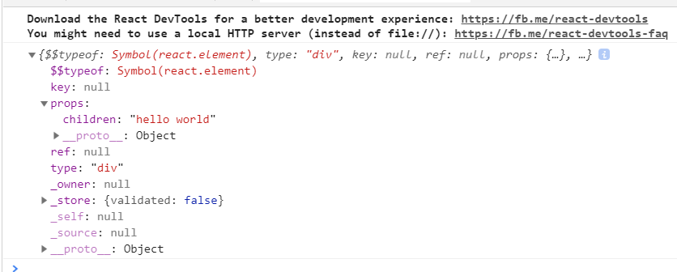
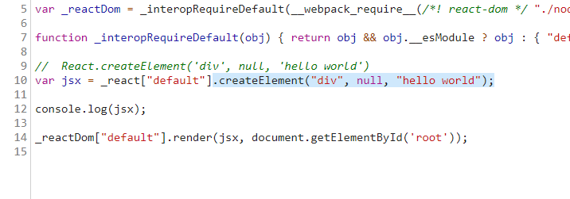

# React

Facebook写的库，2013开源

相比Vue来说出的早一点，并且有大公司的背景

在国内由于众所周知的原因，热度不及Vue

# 官方文档

- [docschina](https://react.docschina.org/)

# create-react-app

脚手架需要全局安装，相当于`vue-cli`

```bash
npx create-react-app my-app
# 这个命令等价于下面的那两条
npm install create-react-app -g
create-react-app my-app
```

vue的局限性，它是一个前端的框架，但是react，node环境是没DOM和BOM，react

```html
<script src="https://unpkg.com/react@16/umd/react.development.js" crossorigin></script>
<script src="https://unpkg.com/react-dom@16/umd/react-dom.development.js" crossorigin></script>
```

- react.js 核心库 是可以单独用于服务端的
- react-dom 操作浏览器DOM功能的JS

完整的前端react项目，是需要两份都有

如果你需要从零自己搭建脚手架你先安装`react`和`react-dom`

```bash
npm install react react-dom --s
```

由于我们需要安装es6，所以我们依赖[babel-loader](https://www.webpackjs.com/loaders/babel-loader/)


```bash
npm install babel-loader@8.0.0-beta.0 @babel/core @babel/preset-env webpack --D
```

# dva

后期我们开发的时候会使用dva，它也是我们常用的react框架

全局安装
```bash
npm install dva-cli -g
dva new dva-quickstart
```

# hello world

```js
import React from 'react'
import ReactDOM from 'react-dom'

ReactDOM.render(
    React.createElement('div', null, 'hello world'),
    document.getElementById('root')
);
```
template必须要vue.js完整版才支持的，但是在脚手架开发的时候，是不使用这个`template`，`.vue`写组件，不懂`jsx`语法，模板的语法

- React构造虚拟DOM
- ReactDOM把虚拟DOM构造为真实DOM

```js
import Vue from 'vue'

new Vue({
    el: '#root',
    template:`
        <div>hello world</div>
    `,
    data:{
        name: 'hello world'
    },
    render(createElement){
        return createElement('div', null, this.name)
    }
})
```

我们的webpack会去处理这份模板，我们写的是类html结构

```html
<div>hello world</div>
```

webpack会把上面那份转化为JS函数
```js
createElement('div', null, this.name)
```
上面会转化为一份对象
```js
{
    tag: 'div',
    text: undefined,
    children: [{
        tag: undefined,
        text: this.name
    }]
}
```

如果需要把模板转化为对象，那需要一个`loader`去帮你处理

```bash
npm install --save-dev babel-plugin-transform-react-jsx
```

再去配置`webpack.config.js`
```js
const path = require('path')
module.exports = {
    mode: 'development',
    entry: './src/index.js',
    output: {
        path: path.resolve(__dirname, 'dist'),
        filename: 'bundle.js'
    },
    module: {
        rules: [
            {
                test: /\.js$/,
                exclude: /(node_modules|bower_components)/,
                use: {
                    loader: 'babel-loader',
                    options: {
                        presets: ['@babel/preset-env'],
                        plugins: ["transform-react-jsx"]
                    }
                }
            }
        ]
    }
}
```
有了上面的配置我们就可以直接把html模板交给webpack处理为函数，再转对象
```js
import React from 'react'
import ReactDOM from 'react-dom'
//  React.createElement('div', null, 'hello world')
const jsx = <div>hello world</div>
ReactDOM.render(
    jsx,
    document.getElementById('root')
);
```




需要注意的是这里跟vue的区别在于，你要绑定M层的数据，只需要用一个大括号，而非两个大括号


```js
import React from 'react'
import ReactDOM from 'react-dom'
//  React.createElement('div', null, 'hello world')
// M
const data = {
    name: 'yao',
    num: 20
}
// M -> V
// V
const jsx = <div>{data.name}</div>
console.log(jsx)
ReactDOM.render(
    jsx,
    document.getElementById('root')
);
```

# 函数式编程

函数返回什么视图就会得到什么

# JSX语法

- 支持三元表达式
- 支持函数式编程
- 

`<JSX></JSX>`等价于`{JSX()}`，组件的本质函数
```js
import React from 'react'
import ReactDOM from 'react-dom'
//  React.createElement('div', null, 'hello world')
// M

const methods = {
    // 过滤器
    currency(num) {
        return `￥${num}`
    }
}
const data = {
    name: 'yao',
    num: 20,
    bool: !0
}
// M -> V
// V
const jsx = <div>
    <p>{data.name}</p>
    <p>{methods.currency(data.num)}</p>
    <p>{methods.currency(999)}</p>
    <p>{data.bool ? '真' : '假'}</p>
</div>
console.log(jsx)
ReactDOM.render(
    jsx,
    document.getElementById('root')
);
```
```js
import React from 'react'
import ReactDOM from 'react-dom'
//  React.createElement('div', null, 'hello world')
// M
// M -> V
// V
const JSX = () => {
    const methods = {
        // 过滤器
        currency(num) {
            return `￥${num}`
        },
        rIf(bool) {
            return bool ? <p>这是真的</p> : <p>这是假的</p>
        },
        rFor(arr) {
            return arr.map((item, index) => {
                return <li key={index}>{item}</li>
            })
        }
    }
    const data = {
        name: 'yao',
        num: 20,
        bool: !0,
        arr: [1, 2, 3]
    }
    return (
        <div>
            <p name={data.name}>{data.name}</p>
            <p name={methods.currency(data.num)}>{methods.currency(data.num)}</p>
            <p>{methods.currency(999)}</p>
            <p>{data.bool ? '真' : '假'}</p>
            <div>{methods.rIf(data.bool)}</div>
            <div>{(() => {
                let name = 'jing';
                return `${name}ing`
            })()}</div>
            <ul>
                {methods.rFor(data.arr)}
            </ul>
        </div>
    )
}
console.log(JSX)
ReactDOM.render(
    <JSX></JSX>,
    document.getElementById('root')
);
```


# 组件

React的组件，基本没有用到任何像Vue的写法，它是跟ES6想匹配

组件的本质是函数，随便定义一个函数，那就是组件

- 组件名称必须以大写字母开头
```js
Vue.extend()
Vue.component()
.vue单文件
```

react的组件就是纯函数
```js
import React from 'react'
// React.createElement('header', null, '微信')
const Header = () => {
    let style = {
        height: '50px',
        width: '100%',
        lineHeight: '50px',
        backgroundColor: 'red',
        textAlign: 'center'
    }
    return (
        <header style={style}>微信</header>
    )
}

export default Header
```

使用函数组件的时候有两种方法
```js
ReactDOM.render(
    <div>
        {Header()}
        {Header()}
        {Header()}
        {Header()}
        <Header />
        <Header />
        <Header />
        <Header />
    </div>,
    document.getElementById('root')
);
```

- 函数组件 无状态组件 M是不动的话
- 类组件组件 有状态组件 M动的话建议用这个

类组件跟函数组件有点类似
```js
import React, { Component } from 'react'
export default class Footer extends Component {
    render() {
        return (
            <footer>底部组件</footer>
        )
    }
}
```

# 数据 Model

Vue 放入data属性里面，或者computed

```
new Vue({
    data:{}
})
```

我们可以通过props，从父组件把props交给子组件

如果是函数组件的话
```html
<div>
    {Header({
        title: '微信',
        age: 16
    })}
    <Header title="微信4" age="16" />
</div>
```
在组件内部用参数接受
```js
const Header = (props) => {
    return (
        <header style={style}>{props ? props.title : '支付宝'}</header>
    )
}
```
如果是类组件的话
```html
<div>
    <Header title="微信4" age="16" />
</div>
```
```js
class Footer extends Component {
    constructor(props) {
        super(props)
    }
    render() {
        return (
            <footer>底部组件{this.props.title}</footer>
        )
    }
}
```
你可以利用props来传递任何类型，包括jsx或者html，实现类似插槽的效果
```html
<Footer title={<p>支付宝</p>} age="16" />
```

VS框架 View-State
```
state(react) === data(vue)
```

你可以在构造器里面写state或者静态方法写state
```js
class Footer extends Component {
    constructor(props) {
        super(props)
        let a = 1
        // Model
        this.state = {
            name: 'yao'
        }
    }
    // state = {
    //     name: 'yao'
    // }
    render() {
        return (
            <footer>底部组件{this.props.title}</footer>
        )
    }
}
```
二阶段的写法对应上面的写法
```js
function Footer(){
    let a = 1
    this.state = {}
}
Footer.prototype.render=()=>{}
Footer.state = {}
```

