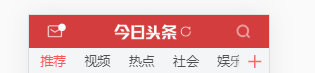

# 作业

预习这份文档

- [react单文件组件](https://wscats.github.io/omi-docs/public/home/)
- [react生命周期](https://react.docschina.org/docs/state-and-lifecycle.html)

定义一个头部组件

拥有三个状态

左边返回按钮，右边是汉堡按钮

通过props和state让这个组件用有三个状态

```html
<Header title="xxx" state={
    back: true,
    ham: false
}>
```

