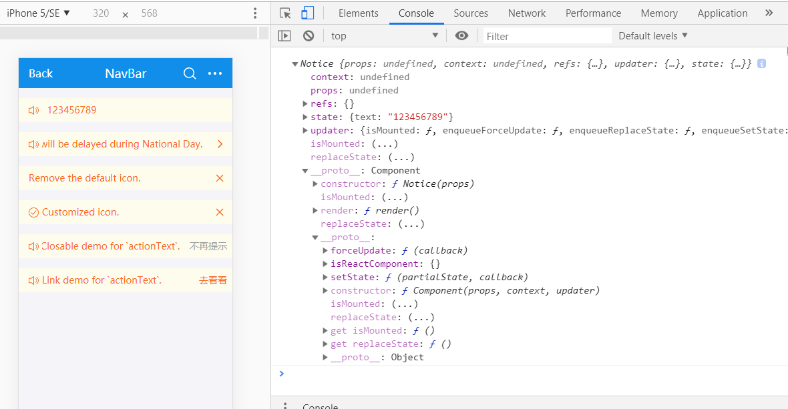

# setState



setState是Component留给组件的

setState是内置方法，一般不要在组件里面定义`setState`，用下面的形式更新state

```js
constructor(props) {
    super(props)
    this.state = {
        text: '123456789',
        bool: false
    }
    setTimeout(() => {
        this.text = '12313'
        this.setState({
            // 你需要更改的值
            text: '987654321',
            bool: !this.state.bool
        }, () => {
            // 更改状态完之后的回调函数
            console.log(this.state.bool)
        })
    }, 2000)
}
```


# 生命周期


```js
class Clock extends React.Component {
  constructor(props) {
    super(props);
    this.state = {date: new Date()};
  }
  //   生命中区
  componentDidMount() {

  }
  componentWillUnmount() {

  }
  render() {
    return (
      <div>
        <h1>Hello, world!</h1>
        <h2>It is {this.state.date.toLocaleTimeString()}.</h2>
      </div>
    );
  }
}
```

# 生命周期

React 是一个由虚拟 DOM 渲染成真实 DOM 的过程，这个过程称为组件的生命周期。React 把这个周期划分为三个阶段，每个阶段都提供了 will 和 did 两种处理方式，will 是指发生前，did 是指发生后。
- Mounting：组件渲染过程
    - componentWillMount()
    	- 挂载前
    - componentDidMount()
    	- 挂载后
- Updating：组件更新过程
    - componentWillReceiveProps(nextProps) 
      - 组件收到新的prop值时触发
    - shouldComponentUpdate(nextProps, nextState) 吹牛逼专用，后期专用
    	- true或false来决定M的改变能否改变V层
    - componentWillUpdate(object nextProps, object nextState) 
    	- 更新前
    - componentDidUpdate(object prevProps, object prevState) 
    	- 更新后
- Unmounting：组件移除过程
    - componentWillUnmount()
    	- 这个阶段没有对应的 did 方法


组件在初始化时会触发5个钩子函数：

|id|钩子函数|用处|
|-|-|-|
|1|getDefaultProps()|设置默认的props，也可以用defaultProps设置组件的默认属性|
|2|getInitialState()|在使用es6的class语法时是没有这个钩子函数的，可以直接在constructor中定义this.state。此时可以访问this.props|
|3|componentWillMount()|组件初始化时只调用，以后组件更新不调用，整个生命周期只调用一次，此时可以修改state|
|4|render()|react最重要的步骤，创建虚拟dom，进行diff算法，更新dom树都在此进行。此时就不能更改state了|
|5|componentDidMount()|组件渲染之后调用，可以通过this.getDOMNode()获取和操作dom节点，只调用一次|

在更新时也会触发5个钩子函数：

|id|钩子函数|用处|
|-|-|-|
|6|componentWillReceivePorps(nextProps)|组件初始化时不调用，组件接受新的props时调用|
|7|shouldComponentUpdate(nextProps, nextState)|react性能优化非常重要的一环。组件接受新的state或者props时调用，我们可以设置在此对比前后两个props和state是否相同，如果相同则返回false阻止更新，因为相同的属性状态一定会生成相同的dom树，这样就不需要创造新的dom树和旧的dom树进行diff算法对比，节省大量性能，尤其是在dom结构复杂的时候。不过调用this.forceUpdate会跳过此步骤|
|8|componentWillUpdate(nextProps, nextState)|组件初始化时不调用，只有在组件将要更新时才调用，此时可以修改state|
|9|render()|同上|
|10|componentDidUpdate()|组件初始化时不调用，组件更新完成后调用，此时可以获取dom节点。还有一个卸载钩子函数|
|11|componentWillUnmount()|组件将要卸载时调用，一些事件监听和定时器需要在此时清除。


以上可以看出来react总共有10个周期函数（render重复一次），这个10个函数可以满足我们所有对组件操作的需求，利用的好可以提高开发效率和组件性能

## Mounting

指首次渲染或者组件从 DOM 中移除后再次重新渲染，后者场景不会执行 getDefaultProps
### 执行顺序
1. getDefaultProps
2. getInitialState
3. componentWillMount
4. render
5. componentDidMount
### componentWillMount
该方法在 render 之前被调用，也就是说在这个方法当中无法获取到真实的 DOM 元素。
首次渲染前和当 state 发生改变时再次渲染前触发该方法。
### componentDidMount
该方法是在 render 之后被调用，也就是这个方法可以直接获取到真实的 DOM 元素。
首次渲染后和当 state 发生改变再次渲染后触发该方法。
```javascript
var MountingComponent = React.createClass({
    componentWillMount: function(){
        console.log(this.refs.h1) // undefined
    },
    componentDidMount: function(){
        console.log(this.refs.h1) // h1 对象
    },
    render: function(){
        return <h1 ref="h1">Lifecycle-Mounting</h1>;
    }                
})
ReactDOM.render(<MountingComponent />, document.getElementById('div1'));
```
## Updating
当改变组件的 props 或 state 时候会触发
### 执行顺序
1. componentWillReceiveProps
2. shouldComponentUpdate
3. componentWillUpdate
4. render
5. componentDidUpdate
### componentWillReceiveProps
在组件接收到一个新的prop时被调用。这个方法在初始化render时不会被调用。
方法接受一个参数
newProps： 为更新后的 props
注：props 不能手动改变，正常场景是当前组件被当子组件调用，然后在父组件中改变该组件的 props
### shouldComponentUpdate
组件挂载之后，每次调用setState后都会调用shouldComponentUpdate判断是否需要重新渲染组件。默认返回true，需要重新render。在比较复杂的应用里，有一些数据的改变并不影响界面展示，可以在这里做判断，优化渲染效率。
方法接受两个参数
newProps：已更新的 props
newState：已更新的 state
方法必须要返回 boolen，返回 true 则执行后面的 componentWillUpdate、render、componentDidUpdate。反之则不执行。
### componentWillUpdate
在组件接收到新的props或者state但还没有render时被调用。在初始化时不会被调用。
方法接受两个参数
nextProps：将要更新的 props
nextState：将要更新的 state
### componentDidUpdate
在组件完成更新后立即调用。在初始化时不会被调用。
方法接受两个参数
prevProps：更新前的 props
nextState：更新前的 state
```javascript
var UpdatingComponent = React.createClass({
    getInitialState: function() {
        return {
            data:0
        };
    },           
    setNewNumber: function() {
        //当 state 发生改变的时候，state 对应的组件会重新挂载
        //会触发 componentWillUpdate、componentDidUpdate
        this.setState({data: this.state.data + 1})
    },
    //参数 newProps：已更新的 props
    componentWillReceiveProps:function(newProps) {
        console.log('Component WILL RECEIVE PROPS!', newProps)
    },        
    //参数 newProps：已更新的 props
    //参数 newState：已更新的 state  
    //必须要返回 boolen，true 则执行componentWillUpdate、render、componentDidUpdate。反之则不执行。
    shouldComponentUpdate: function(newProps, newState){
        console.log('shouldComponentUpdate',newProps, newState);
        return (newState.data > 0 && newState.data % 2 == 0);
    },                          
    //参数 nextProps：将要更新的 props
    //参数 nextState：将要更新的 state
    componentWillUpdate: function(nextProps, nextState){
        console.log(nextProps, nextState, this.refs.p1)
    },
    //参数 prevProps：更新前的 props
    //参数 nextState：更新前的 state                
    componentDidUpdate: function(prevProps, prevState){
        console.log(prevProps, prevState) 
    },
    render: function(){
        return (
            <div>
                <button onClick={this.setNewNumber}>INCREMENT</button>
                <h3>{this.state.data}</h3>
            </div>
        );
    }                
})
ReactDOM.render(<UpdatingComponent/>, document.getElementById('div2'));
```
## Unmounting
在组件从 DOM 中移除的时候立刻被调用，这个阶段没有对应的 did 方法
### componentWillUnmount
方法适用在父子组件的结构中，当某个条件符合的场景下，该子组件会被渲染
### 重新渲染的执行顺序
1. getInitialState
2. componentWillMount
3. render
4. componentDidMount
```javascript
var ChildrenComponent = React.createClass({
    componentWillUnmount: function(){
        console.log('componentWillUnmount');
    },
    render: function(){
        return <h3>{this.props.myNumber}</h3>
    }
})

var UnmountingComponent = React.createClass({
    getInitialState: function() {
        return {
            data:0
        };
    },
    setNewNumber: function() {
        this.setState({data: this.state.data + 1})
    },
    render: function () {
        var content;
        //当条件不符合时 ChildrenComponent 会被移除，然后会触发方组件的 componentWillUnmount 方法
        //当条件重新符合时，会重新渲染组件 ChildrenComponent
        if(this.state.data % 2 == 0){
            content = <ChildrenComponent myNumber = {this.state.data}></ChildrenComponent>;
        } else {
            content = <h3>{this.state.data}</h3>;
        }
        return (
            <div>
                <button onClick = {this.setNewNumber}>INCREMENT</button>
                {content}
            </div>
        );
    }
})

ReactDOM.render(<UnmountingComponent/>, document.getElementById('div3'));
```

### 效果预览

- [组件的生命周期DEMO1](https://wscats.github.io/react-tutorial/react/component/src/lifecycle/lifecycle.html)
- [组件的生命周期DEMO2](https://wscats.github.io/react-tutorial/react/component/src/lifecycle/生命周期.html)

## 事件处理

React的事件很像这个原生的写法，有规律是`onXxxx` `on`后面个一个大写字母
```js
<button onClick={activateLasers}>
  Activate Lasers
</button>
```
跟vue不一样
```html
<button @click="activateLasers"></button>
```
事件绑定是唯一一种方式实现从视图层把数据带回数据层，Vue里面要用两个指令实现(v-model,v:on)，都需要用事件自己处理，包括输入框的值也需要`onChange`来去处理，并且注意的是事件绑定的时候，函数内部的this是undefined，所以如果你需要操作组件内部的状态（数据）`onXxxx = this.方法名.bind(this,xxx)`，方法一般建议放到组件的原型链上面
```js
import React, { Component } from 'react'
const Fn = () => {
    console.log(1)
}
class Notice extends Component {
    constructor(props) {
        super(props)
        this.props = props
        this.state = {
            text: 1,
            Fn() {
                console.log(3)
            }
        }
    }
    Fn() {
        this.setState({
            text: 8
        })
    }
    getInputValue(num,num2,e) {
        this.setState({
            text: e.target.value
        })
    }
    render() {
        return (
            <div>
                <button onClick={Fn}>ok</button>
                <button onClick={this.Fn.bind(this)}>ok</button>
                <button onClick={this.state.Fn}>ok</button>
                <input value={this.state.text} onChange={this.getInputValue.bind(this,333,222)} />
            </div>
        )
    }
}
export default Notice
```

如果你需要函数带参数
```js
// Methods
getInputValue(param1, params2, e) {
    console.log(param1, params2, e.target.value)
    this.setState({
        text: e.target.value
    })
}
// View
{this.getInputValue.bind(this,333,222)} />
```

### vFor

```js
<ul>{
    this.state.arr.map((item, index) => {
        return (<li key={index}>{item}</li>)
    })
}</ul>
```

### vIf

```js
import React, { Component } from 'react'
export default class Footer extends Component {
    constructor(props) {
        super(props)
        this.state = {
            title: '底部组件123',
            bool: !0,
            arr: [1, 2, 3],
            html: <p>123</p>
        }
    }
    render() {
        return (
            <div>
                <p style={{ color: 'red' }}>1.v-for</p>
                <ul>{
                    this.state.arr.map((item, index) => {
                        return (<li key={index}>{item}</li>)
                    })
                }</ul>
                <hr />
                <ul>{
                    ((self) => {
                        ;;;;;;; let arr = this.state.arr;;;;;;
                        let newArr = [];;;;;;;;;;;;;;;;;;;;;;;
                        for (let i = 0; i < arr.length; i++) {
                            newArr.push(<li key={i}>{arr[i]}</li>)
                        }
                        return newArr
                    })(this)
                }</ul>
                <p style={{ color: 'red' }}>2.v-if</p>
                {this.state.bool ? (
                    <p>真的</p>
                ) : (
                        <p>假的的</p>
                    )}
                <button onClick={() => {
                    this.setState({
                        bool: !this.state.bool
                    })
                }}>ok</button>
                <p style={{ color: 'red' }}>3.v-show</p>
                <p style={{
                    display: this.state.bool ? 'block' : 'none'
                }}>显示或者隐藏</p>
                <button onClick={() => {
                    this.setState({
                        bool: !this.state.bool
                    })
                }}>ok</button>
                <p style={{ color: 'red' }}>4.v-else</p>
                <p>{
                    ((self) => {
                        switch (self.state.bool) {
                            case true:
                                return <span>真的</span>
                            default:
                                return <span>假的</span>
                        }
                    })(this)
                }</p>
                <p style={{ color: 'red' }}>5.v-html</p>
                <div>{this.state.html}</div>

            </div>
        )
    }
}
```

