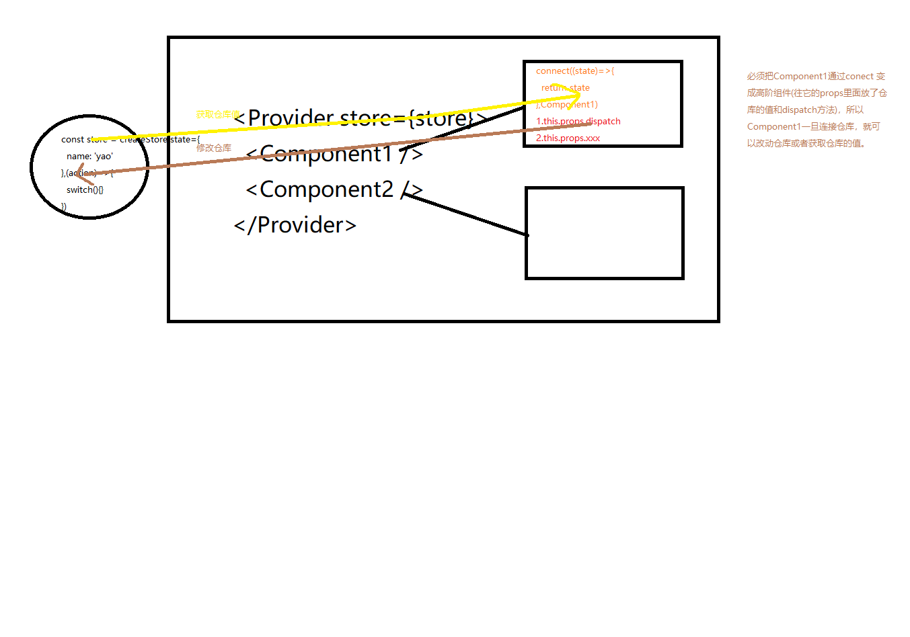

# redux

vuex

react项目开发中基本都在写组件，组件是高度独立，组件模块化的方案，隔绝代码，隔绝作用域，组件之间要建立通信，借助vuex,redux去协调

vuex，redux相当于这个代理人的角色，cookie和本地存储

- vuex和redux都会把通信数据放内存，页面刷新了就没了，单页面应用最怕刷新
- cookie和本地存储放硬盘，页面刷新关闭还在

它不是官方提供的插件，相比vuex，vue组织去维护的，但是redux是民间爱好者

react追求自由，灵活

redux是可以用于任何框架的，redux其实不是专门为react定制的

```bash
npm install --save redux
```
react-redux是redux对react支持，友好在react，建议安装react-redux
```js
npm install --save react-redux
```

这里需要再强调一下：Redux 和 React 之间没有关系。Redux 支持 React、Angular、Ember、jQuery 甚至纯 JavaScript。

jquery mobile

angular 谷歌
vue 
react facebook

vuex

- state
- getters
- actions
- mutations

redux创建仓库的过程

```js
import { createStore } from 'redux';
// 构造数据处理中心
const counter = (state = {
    num: 100,
    name: 'yao'
}, action) => {
    // 执行对应的动作
    switch (action.type) {
        case 'GETSUM':
            return {
                num: state.num + 10
            }
        case 'GETNAME':
            return {
                name: state.name
            }
    }
}
// 创建仓库
const store = createStore(counter);
export default store;
```

- store.getState()
- store.subscribe()
- store.dispatch()

你需要组件里面导入`store`
```js
import store from '../store/store';
// 组件监听仓库的变化相当于vue computed+getters
store.subscribe(() => console.log(store.getState()))
// dispatch触发仓库里面的action，从而更改state里面的值
store.dispatch({
    type: 'GETSUM'
})
store.dispatch({
    type: 'SETNAME',
    name: 'jing'
})
```

如果按上面的写法，你需要每一个组件都要重新注入`store`，利用`react-redux`提供一个`<Provider></Provider>`组件它接受上面的`store`，让应用可以通过一些方法访问仓库
```js
new Vue({
    store // 类似在跟容器里面注入store
})
```
```js
import { Provider } from 'react-redux'
render(
  <Provider store={store}>
    <App />
  </Provider>,
  document.getElementById('root')
)
```
用`connect`方法将Test2组件进阶为高阶组件，从而在props里面获取仓库`store`的值，并且有这个`dispatch`的方法
```js
import React from 'react'
import { connect } from 'react-redux'

// 多了一些props属性
class Test2 extends React.Component {
    // this.props.plus
    render() {
        return (
            <React.Fragment>
                <div>Test</div>
                <div>Test1</div>
                <div>Test1</div>
                <div>Test1</div>
            </React.Fragment>
        )
    }
    componentDidMount() {
        console.log(this)
    }
}
export default connect((state)=>{
    return state
})(Test2)
```


# dva的model

dva封装了一个redux的方法

导出一个仓库
```js
export default {
    namespace: 'products',
    state: {
        arr: ['ps', 'js', 'css']
    },
    reducers: {
        // 返回一个全新state
        'add'(state, { payload: arr }) {
            return {
                arr: [...state.arr,...arr]
            }
        },
    },
};
```
在index.js加载
```js
app.model(require('./models/products').default);
```
在组件里面connect，在组件里面调用props的dispatch方法去更改model，而数据会实时返回到props值上面
```js
export default connect(({ products }) => ({
    products,
}))(EditableTable)
```

# Typescript

弱类型语言，定义变量那一刻是不知道变量的类型，变量的类型是有可能改变的
```js
var a;
a = 1;
a = 'abc'
```
大型项目如果类型不确定，你的队友可能会跳坑，在大型项目里面类型要有规范，诞生typescript去处理这种事情

全局安装typescript模块
```bash
npm install -g typescript
```
你可以写一份ts的后缀文件，并使用`tsc`编译该文件，最终会编译为`js`
```js
tsc helloworld.ts
```
编写一份`test.ts`，用命令行编译`tsc test.ts`
```js
const a = 1
const fn = () => {
    console.log(1)
}
```